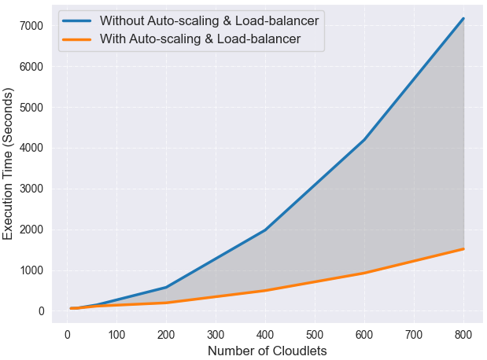
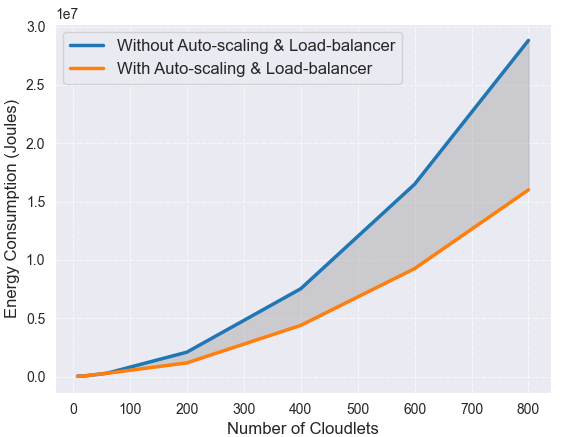
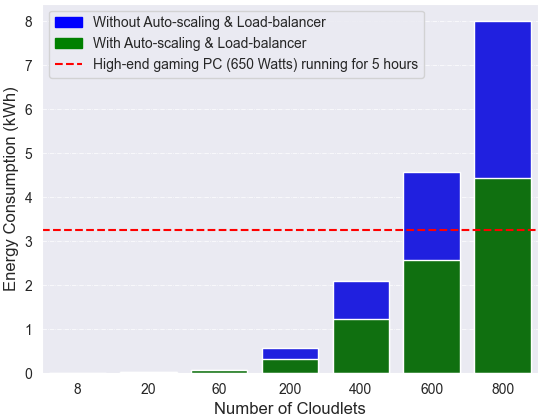
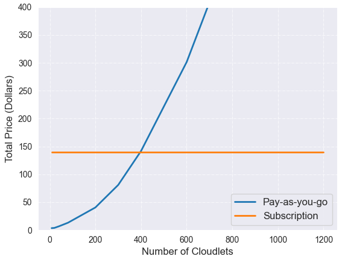
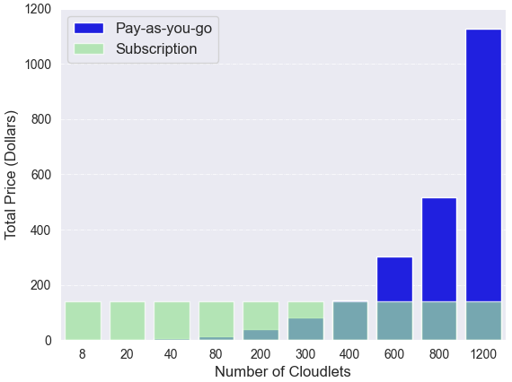
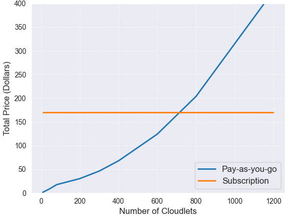
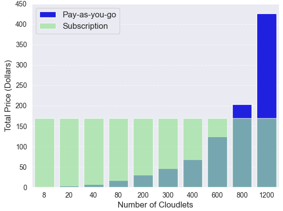
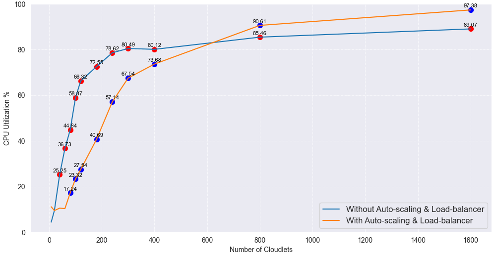

 
 # Bedrock Evaluation Results
 
**Execution Time**

 performance.py
 
 

 **Total Energy Consumption**

 energy-consumption.py

 

 **Power Consumption in kWh**

 energy-consumption-kwh.py
 
 

 **Pricing Models without Auto-scaling & Load-Balancer**

 pricing-models.py

 

 pricing-models-bar.py

 

 **Pricing Models without Load Balancer**

 pricing-models-autoscaling.py

 

 pricing-models-bar-autoscaling.py

 

 **CPU Utilization**

 cpu-utilization.py

 

